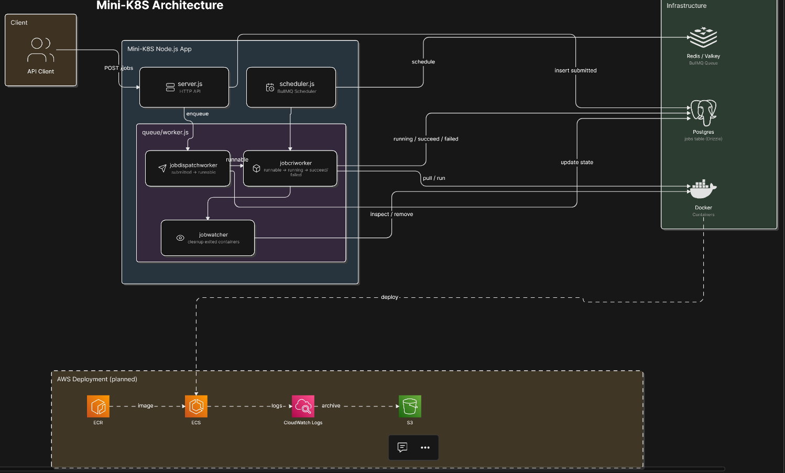
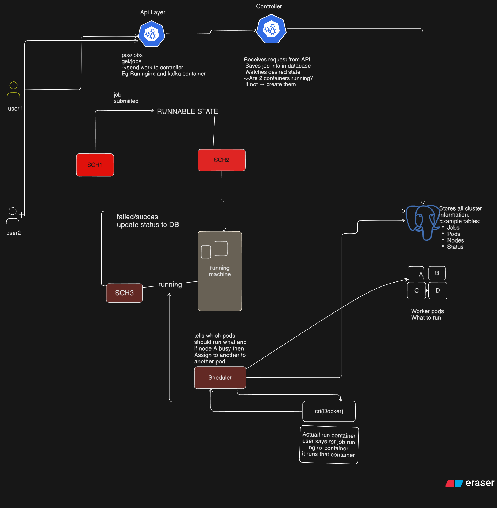

# Mini-K8S

Mini-K8S is a lightweight Node.js job runner that stores job state in Postgres, schedules work with BullMQ, and launches containers with Docker.

## What It Does

- Accepts jobs through the HTTP API
- Moves jobs through `submitted`, `runnable`, `running`, `succeed`, and `failed` states
- Pulls Docker images and starts containers for jobs
- Stores container IDs and error messages in the database
- Can be extended to run on AWS with ECR and ECS

## Scripts

| Command | Description |
| --- | --- |
| `pnpm dev` | Starts the HTTP server with Nodemon |
| `pnpm worker` | Starts the scheduler and worker loop with watch mode |
| `pnpm db-generate` | Generates Drizzle artifacts |
| `pnpm db-migrate` | Runs database migrations |
| `pnpm db-studio` | Opens Drizzle Studio |

## Architecture Overview

### Main Flow
1. `server.js` accepts a job request.
2. The job is inserted into the `jobs` table with `submitted` state.
3. `scheduler.js` runs BullMQ schedulers.
4. `queue/worker.js` moves jobs into runnable/running state.
5. The worker pulls the Docker image, starts the container, and waits for it to finish
6. The worker updates the database with the final status and any error message

### Scheduler and State Flow

The project has three scheduler/worker phases:

#### 1. Dispatch Phase
- `jobdispatchworker` reads jobs whose state is `submitted`
- It marks them as `runnable`
- This is the handoff from API-created job to executable job

#### 2. CRI Execution Phase
- `jobcriworker` reads jobs whose state is `runnable`
- It marks them as `running` before container work starts
- It pulls the Docker image if needed

- It creates the container, starts it, stores the `containerId`, and waits for exit
- If the container exits with code `0`, the job becomes `succeed`
- If the container exits with a non-zero code or throws an error, the job becomes `failed`

#### 3. Watcher Cleanup Phase

- `jobwatcher` checks jobs that are in the `running` path and inspects the stored `containerId`
- If Docker reports the container as `exited`, the worker removes it
- This keeps Docker Desktop clean after the job is finished

### State Definitions

| State | Description |
| --- | --- |
| `submitted` | The job was created by the HTTP API but not dispatched yet |
| `runnable` | The dispatcher picked it up and it is ready for container execution |
| `running` | The CRI worker has reserved it and the container is being managed |
| `succeed` | The container exited successfully with status code `0` |
| `failed` | The container exited with an error or the worker hit a runtime problem |

## Observability

### Drizzle Studio

Drizzle Studio shows the `jobs` table in Postgres and is the **source of truth for job state**.

- When you create a job in `server.js`, a new row appears as `submitted`
- After the dispatcher runs, that same row changes to `runnable`
- After the CRI worker starts the container, the row changes to `running` and stores the Docker `containerId`
- After the container finishes, the row changes to `succeed` or `failed`
- If something fails, the `errorMessage` column explains why

### Docker Desktop

Docker Desktop is the **source of truth for containers**, not job state.

- While the CRI worker is starting the container, you may see it in the running containers list
- If the command finishes quickly, the container may move to exited state very fast
- If the worker cleanup runs, the container may be removed after it exits
- If `AutoRemove` is enabled, Docker can delete the container immediately after exit

> **Key distinction:** Drizzle Studio shows the job lifecycle. Docker Desktop shows the container lifecycle. They are related, but not identical.

### Why Containers May Not Appear After Job Success

This is expected behavior for short-lived jobs such as `busybox`:

- The job can succeed in Drizzle because the container exited with code `0`
- Docker Desktop may not show it anymore because the container already exited
- The worker may also remove exited containers during cleanup
- For debugging, use a longer command like `sleep 100` if you want the container to remain visible

## AWS Deployment

This project can be deployed to AWS using:

- **ECR** for storing the container image
- **ECS** for running the container
- **CloudWatch Logs** for runtime logs
- **S3** for optional log archives or job artifacts

See [aws integration.md](aws%20integration.md) for the full deployment plan.

## Project Structure

| File | Description |
| --- | --- |
| [server.js](server.js) | HTTP API for creating jobs |
| [scheduler.js](scheduler.js) | BullMQ scheduler bootstrap |
| [queue/queue.js](queue/queue.js) | Queue definitions |
| [queue/worker.js](queue/worker.js) | Job dispatcher, Docker worker, and container watcher |
| [DB/index.js](DB/index.js) | Postgres/Drizzle connection |
| [DB/Schema.js](DB/Schema.js) | Job table schema and state enum |

## Configuration

### Environment Variables

| Variable | Description |
| --- | --- |
| `DATABASE_URL` | Postgres connection string |
| `PORT` | HTTP server port |
| Redis/Valkey host and port | Queue connection settings (optional) |

## Notes

- Docker Desktop must be running for local container execution
- Short-lived images such as `busybox` may exit very quickly unless you pass a long-running command like `sleep 100`
- If you want containers to stay visible in Docker Desktop for debugging, keep `AutoRemove` disabled until your cleanup step runs

